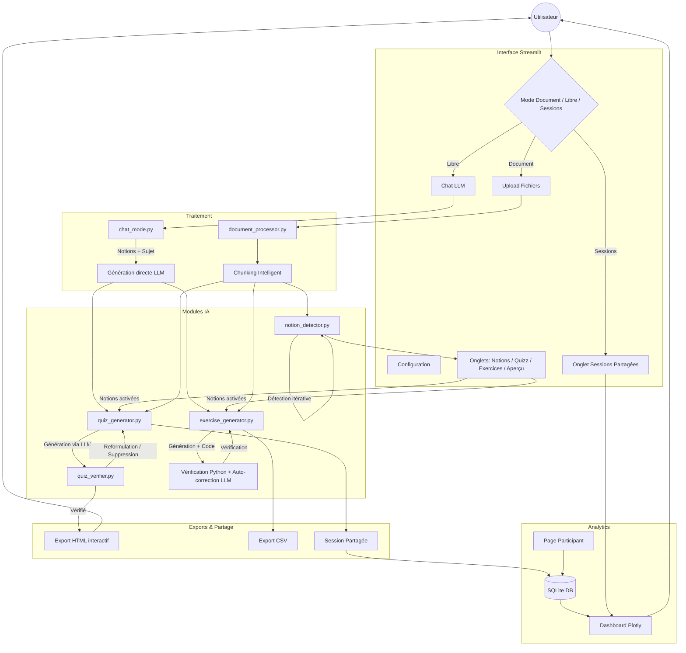

# 📝 Générateur de Quizz & Exercices IA (Streamlit + LangGraph)

Application Streamlit permettant de générer automatiquement des **Quizz QCM** et des **Exercices mathématiques/logiques** à partir de **multiples documents** PDF, DOCX, ODT, PPTX et TXT, ou **directement par conversation avec l'IA** (mode libre), en utilisant des modèles LLM via l'API OpenAI (ou compatible).

## ✨ Fonctionnalités

### 🎯 Quizz QCM

- **Support multi-documents** : Uploadez **plusieurs fichiers simultanément** et générez des questions couvrant l'ensemble des documents.
- **Extraction multi-format** : Support des fichiers **PDF, DOCX, ODT, ODP, PPTX et TXT**.
- **Extraction flexible** du texte :
  - **Mode "Page par page / Slide par slide"** : Idéal pour conserver la référence précise des sources.
  - **Mode "Par blocs de tokens"** : Permet d'analyser de longs contextes en continu (fenêtre glissante).
- **Sélection dynamique du modèle** : Choisissez le modèle LLM directement depuis l'interface (récupération automatique via l'API).
- **Génération multi-niveaux** :
  - Configurez simultanément le nombre de questions pour chaque niveau (**Facile**, **Moyen**, **Difficile**) en un seul run.
  - **Éditeur de Prompts** : Personnalisez totalement les instructions pédagogiques pour chaque niveau de difficulté directement dans l'interface.
- **Paramétrage précis** :
  - Nombre de choix de réponses (A, B, C, D... jusqu'à G).
  - Nombre de bonnes réponses (choix multiple possible).
- **Questions autonomes** : Les questions sont conçues pour être répondables **sans le document source**, uniquement avec les connaissances acquises en formation. Aucune référence de type "selon le texte" n'est utilisée.
- **Tags de notions** : Chaque question affiche les **notions fondamentales** qu'elle couvre sous forme de badges cliquables, permettant d'identifier immédiatement les concepts testés.
- **Export HTML interactif** : Téléchargez un fichier HTML autonome avec design sombre, score en temps réel et explications détaillées.
- **Export CSV robuste** : Séparateur `;`, guillemets systématiques (`QUOTE_ALL`), BOM UTF-8 pour compatibilité Excel. Les retours à la ligne dans les champs sont remplacés par ` | `.
- **Badges de difficulté** : Chaque question affiche son niveau de difficulté avec un badge coloré (🟢 Facile, 🟡 Moyen, 🔴 Difficile).
- **Vérification IA des réponses** : Un bouton dédié permet au LLM de **relire le document source** et de tenter de répondre à chaque question comme un étudiant. Si le LLM échoue (mauvaise réponse ou mauvais nombre de réponses), la question est **reformulée automatiquement** (jusqu'à 3 tentatives). Si la question reste incorrecte après 3 reformulations, elle est **supprimée**. Les tentatives sont affichées discrètement dans un expander et loguées.
- **Citations précises** : Les explications incluent une citation exacte du texte source.
- **Attribution des sources** : Document source et numéro de page précis pour chaque question.

### 🧮 Exercices & Problèmes (Maths / Logique / Science)

- **Trois niveaux de difficulté distincts** :
  - 🟢 **Facile** : Application numérique directe d'une formule ou d'un concept en une étape.
  - 🟡 **Moyen** : Raisonnement multi-étapes combinant plusieurs formules ou concepts.
  - 🔴 **Difficile** : Résolution complexe de niveau études supérieures (modélisation, optimisation, démonstration).
- **Exercices autonomes** : L'énoncé fournit toutes les données nécessaires, résolvable sans le document source. Toute référence au document est strictement interdite dans l'énoncé ("selon le texte", "d'après le document", etc.).
- **Tags de notions** : Chaque exercice indique les notions fondamentales qu'il couvre.
- **Vérification pas à pas** : Le code Python de vérification affiche chaque étape intermédiaire avec `print()`, permettant un suivi détaillé des calculs.
- **Auto-correction par l'IA** : Si la vérification échoue, le système renvoie automatiquement le résultat du code Python au LLM pour corriger la solution, puis re-vérifie.
- **Code de vérification complet** : Le code Python reproduit intégralement le raisonnement pas à pas (pas de simple `result = valeur`).
- **Prompts personnalisables par niveau** : Modifiez les instructions envoyées à l'IA pour chaque niveau de difficulté. Le bloc FORMAT DE RÉPONSE (JSON strict) est fixe et non modifiable, garantissant la stabilité du parsing.
- **Retry automatique JSON** : Si le LLM produit un JSON invalide, le système relance automatiquement l'appel jusqu'à 3 fois.
- **Affichage complet** : Énoncé, Réponse attendue, Étapes de résolution détaillées, Code de vérification Python.
- **Citations et sources** : Chaque exercice indique la citation du texte source et le document/page d'origine.

### 💬 Mode Libre (Génération par conversation IA)

- **Sans document requis** : Générez des quizz et exercices sur **n'importe quel sujet** sans uploader de fichier.
- **Conversation guidée** : L'IA pose des questions pour comprendre le sujet, le niveau et le périmètre souhaités.
- **Génération automatique de notions** : À partir de la conversation, l'IA identifie les notions fondamentales du sujet.
- **Validation interactive** : Revoyez, activez/désactivez ou modifiez les notions proposées avant la génération.
- **Extraction automatique des préférences** : Si vous mentionnez un nombre de questions ou un niveau de difficulté dans la conversation (ex: *"10 questions faciles"*), le formulaire de configuration est **pré-rempli** automatiquement.
- **Génération directe** : Le LLM génère les questions directement à partir du sujet et des notions — **aucun document fictif intermédiaire** n'est créé.
- **Session partagée** : Après génération, vous pouvez créer une session partagée directement depuis le mode libre.
- **Même qualité d'export** : Les quizz et exercices générés en mode libre bénéficient des mêmes exports (HTML, CSV) et du même affichage que le mode document.

### 📚 Notions Fondamentales

- **Détection automatique** : L'IA identifie les concepts clés, définitions, théorèmes et principes des documents.
- **Fusion des notions similaires** : Bouton **"🔗 Regrouper les notions"** — le LLM fusionne automatiquement les notions redondantes ou similaires pour obtenir une liste plus concise et claire.
- **Édition interactive** : Activez/désactivez, supprimez ou ajoutez manuellement des notions.
- **Chat LLM** : Modifiez les notions en langage naturel (ex: *« Ajoute une notion sur les dérivées partielles »*).
- **Guidage de la génération** : Les notions activées servent de base de critères pour orienter le LLM — elles lui fournissent le contexte des concepts clés sur lesquels appuyer la génération des questions et exercices.
- **Tagging automatique** : Chaque question et exercice généré est automatiquement associé aux notions qu'il couvre (champ `related_notions`).
- **Barre de progression avec ETA** : Affichage du temps restant estimé pendant la détection (style tqdm).

### 🔗 Sessions Partagées & Analytics

- **Partage de quizz** : Après la génération d'un quizz, créez une **session partagée** avec un code unique (ex: `K8S42X`).
- **Page participant** : Les participants accèdent au quizz via une URL Streamlit dédiée (`/quiz_session?code=...`), saisissent leur nom et répondent aux questions.
- **Scoring côté serveur** : Les réponses correctes ne sont jamais envoyées au client — le calcul du score est effectué côté serveur pour éviter la triche.
- **Correction détaillée** : Après soumission, chaque participant voit son score, les bonnes réponses et les explications.
- **Dashboard Analytics** (onglet dédié) :
  - **Métriques globales** : Nombre de participants, score moyen, score médian.
  - **Taux de réussite par question** : Graphique en barres coloré (vert/orange/rouge) identifiant les questions difficiles.
  - **Taux de réussite par notion** : Graphique radar montrant quelles notions posent problème aux participants.
  - **Classement des participants** : Tableau avec podium (🥇🥈🥉), score et pourcentage.
- **Gestion des sessions** : Fermez une session pour empêcher de nouvelles soumissions.
- **Onglet "Sessions Partagées"** : Mode dédié dans la barre latérale pour consulter **toutes les sessions**, visualiser les questions et accéder aux analytics sans quitter l'interface principale.
- **Bouton Rafraîchir** : Les participants peuvent rafraîchir la page après soumission pour voir leurs résultats immédiatement (compatible Docker).
- **Stockage persistant** : Les sessions et résultats sont stockés en base SQLite.

### 📊 Statistiques & Suivi Global

- **Tableau de bord** : Suivi persistant du nombre total de questions et exercices générés, de documents traités et de tokens consommés (IA).
- **Interface intégrée** : Affichage permanent des métriques globales dans la barre latérale pour suivre l'utilisation de l'outil dans le temps.

---

## 🛠️ Installation

### Prérequis

- Python 3.10 ou supérieur.
- [uv](https://github.com/astral-sh/uv) (recommandé pour la gestion d'environnement, sinon pip/conda).
- Accès à une API compatible OpenAI (OpenAI, LocalAI, vLLM, etc.).

### 1. Cloner le projet

```bash
git clone <votre-repo>
cd generateur_de_quizz
```

### 2. Créer l'environnement virtuel et installer les dépendances

**Avec UV (recommandé) :**

```bash
uv venv .venv
# Windows
.venv\Scripts\activate
# Linux/Mac
source .venv/bin/activate

uv pip install -r requirements.txt
```

**Avec Pip standard :**

```bash
python -m venv .venv
# Activer l'environnement...
pip install -r requirements.txt
```

### 3. Configuration (.env)

Copiez le fichier `.env.example` vers `.env` et configurez vos accès API :

```bash
cp .env.example .env
```

Éditez `.env` :

```ini
# URL de base de votre API (ex: API locale, OpenAI, vLLM...)
OPENAI_API_BASE=http://votre-serveur:8080/v1

# Clé API (si nécessaire)
OPENAI_API_KEY=sk-xxxxxxxxxxxxxxxx

# Nom du modèle à utiliser
MODEL_NAME=gtp-oss-120b

# Fenêtre de contexte du modèle (en tokens)
MODEL_CONTEXT_WINDOW=32000

# Encodeur tiktoken (cl100k_base pour GPT-4, o200k_base pour GPT-4o)
TIKTOKEN_ENCODING=cl100k_base

# Base de données SQLite pour les sessions partagées (optionnel)
QUIZ_SESSIONS_DB=shared_data/quiz_sessions.db
```

---

## 🚀 Utilisation

Lancez l'application Streamlit :

```bash
streamlit run app.py
```

L'application s'ouvrira dans votre navigateur par défaut (généralement `http://localhost:8501`).

### Mode Document (depuis un fichier)

1. **Upload** : Chargez un ou **plusieurs fichiers** (PDF, DOCX, ODT...) dans la barre latérale.
2. **Configuration** :
    - Ajustez le mode de lecture et la taille des chunks.
    - Sélectionnez le **Modèle LLM** souhaité dans la liste déroulante.
3. **Onglet Notions** :
    - Cliquez sur **"🔍 Détecter les notions fondamentales"** pour identifier les concepts clés (barre de progression avec temps restant estimé).
    - Cliquez sur **"🔗 Regrouper les notions"** pour fusionner les notions similaires ou redondantes.
    - Activez/désactivez les notions pour guider la génération.
    - Utilisez le chat LLM pour modifier les notions en langage naturel.
4. **Onglet Quizz** :
    - Saisissez le nombre de questions pour chaque niveau (🟢 Facile, 🟡 Moyen, 🔴 Difficile).
    - (Optionnel) Modifiez les instructions spécifiques envoyées à l'IA dans l'expandeur **"Personnaliser les Prompts"**.
    - Cliquez sur **"Générer le Quizz"**.
    - Visualisez les questions avec leurs badges de difficulté, tags de notions, citations et sources. Téléchargez en HTML ou CSV.
    - (Optionnel) Cliquez sur **"🔍 Vérifier les réponses par l'IA"** pour que le LLM relise le document et vérifie chaque question. Les questions incorrectes sont reformulées ou supprimées automatiquement.
    - Cliquez sur **"📤 Créer une session partagée"** pour partager le quizz avec des participants.
5. **Onglet Exercices** :
    - Saisissez le nombre d'exercices pour chaque niveau (🟢 Facile, 🟡 Moyen, 🔴 Difficile).
    - (Optionnel) Modifiez les **prompts par niveau** dans l'expandeur **"Personnaliser les Prompts d'Exercice"** (le bloc JSON est fixe et non modifiable).
    - Cliquez sur **"Générer les Exercices"**.
    - L'IA va générer, *vérifier pas à pas* et *auto-corriger* chaque exercice via l'exécution de code Python complet.

### Mode Libre (sans document)

1. Sélectionnez **"💬 Mode libre (IA)"** dans la barre latérale.
2. **Décrivez le sujet** souhaité dans le chat (ex: *"Je veux 10 questions faciles sur Kubernetes"*).
3. L'IA pose quelques **questions de clarification** (niveau, aspects spécifiques, périmètre).
4. L'IA propose des **notions fondamentales** — validez-les ou modifiez-les.
5. **Configurez** le nombre de questions/exercices par niveau (pré-rempli depuis la conversation) et lancez la génération.
6. Les résultats sont affichés et exportables exactement comme en mode document.
7. (Optionnel) Cliquez sur **"📤 Créer une session partagée"** pour partager le quizz.

### Sessions Partagées

1. Sélectionnez **"📡 Sessions Partagées"** dans la barre latérale.
2. Choisissez une session dans la liste déroulante.
3. **Onglet Questions** : Visualisez toutes les questions avec réponses, explications et tags de notions.
4. **Onglet Quizz Session Analytics** : Consultez les graphiques de réussite et le classement des participants.

## 🧠 Fonctionnement détaillé

### 📏 Stratégies de Chunking

Le logiciel découpe le PDF en "chunks" (segments) avant de les envoyer au LLM pour éviter de dépasser la fenêtre de contexte et pour permettre une analyse ciblée :

- **Page par page** : Chaque page est traitée comme une unité isolée. C'est la méthode la plus précise pour l'attribution des sources.
- **Par blocs de tokens (Défaut)** : Le texte est découpé en segments de taille fixe (ex: 10 000 tokens) avec chevauchement.
  - Idéal pour analyser des contextes longs.
  - **Précision** : Des marqueurs `[Début Page X] ... [Fin Page X]` sont insérés automatiquement dans le texte pour que l'IA puisse citer précisément ses sources, même au milieu d'un bloc de 50 pages.

### 🎯 Distribution des Questions (Quizz)

Le système ne se contente pas d'envoyer tout le texte au hasard. Pour un quizz de $N$ questions :

1. Il calcule le poids de chaque chunk par rapport au volume total de texte.
2. Il répartit les $N$ questions proportionnellement à la taille des chunks.
3. Seuls les chunks "utiles" sont envoyés à l'IA, optimisant ainsi la consommation de tokens et la pertinence pédagogique.

### 🧮 Distribution des Exercices

Pour chaque niveau de difficulté demandé, le système sélectionne des chunks répartis uniformément dans le document, garantissant une couverture équilibrée du contenu. Les exercices de niveaux différents peuvent provenir de chunks différents.

### 🤖 Vérification & Auto-correction (Exercices)

Contrairement aux quizz classiques, les exercices mathématiques ou logiques passent par un cycle de **vérification et correction en boucle fermée** :

1. **Génération** : Le LLM crée l'énoncé, la solution et un script Python de vérification avec affichage pas à pas (`print()` à chaque étape).
2. **Exécution** : Le script est exécuté dans un **sous-processus isolé** (sandbox avec timeout).
3. **Validation** : Le système compare le résultat de l'exécution avec la réponse annoncée par le LLM. La comparaison numérique est **robuste** : elle tolère les différences de format (entier vs décimal : `10` vs `10.0`), les virgules décimales françaises (`10,5`), les séparateurs de milliers (`1 000`, `1.000,5`) et les suffixes d'unités (`3.14 m`, `42.5%`).
   - Si les résultats concordent, l'exercice est marqué comme **Vérifié ✅**.
   - Si la vérification échoue : le résultat du code Python est renvoyé au LLM pour **correction automatique** de la solution et des étapes, puis une **re-vérification** est effectuée.
   - En cas d'erreur ou de JSON invalide, le système relance automatiquement la génération (jusqu'à 3 tentatives).
4. **Détails de vérification** : L'affichage montre les calculs intermédiaires, le résultat obtenu vs attendu, et le statut final (Vérifié ✅ / Erreur ❌).

### 🔍 Vérification IA des réponses QCM

Après la génération d'un quizz en mode document, un bouton permet de lancer une **vérification automatique par le LLM** :

1. **Vérification** : Le LLM relit le document source et tente de répondre à chaque question **comme un étudiant**, sans voir les bonnes réponses. Il sélectionne ses réponses et justifie son raisonnement.
2. **Comparaison** : Les réponses du LLM sont comparées aux bonnes réponses attendues.
3. **Reformulation** (si échec) : Si le LLM ne trouve pas la bonne réponse, la question et les choix sont **reformulés automatiquement** pour éliminer les ambiguïtés, puis re-vérifiés. Ce cycle se répète **jusqu'à 3 fois**.
4. **Suppression** (si toujours incorrect) : Si après 3 reformulations le LLM échoue toujours, la question est **supprimée** du quizz.
5. **Rapport** : Un résumé affiche le nombre de questions vérifiées, reformulées et supprimées. Les détails de chaque tentative (réponses LLM, raisonnement, résultat) sont consultables dans un expander discret et loguées via `logging`.

### 💬 Mode Libre — Génération par conversation

Le mode libre utilise une **machine à états** pour guider la conversation :

1. **Découverte du sujet** : Le LLM explore le thème avec l'utilisateur via un chat libre.
2. **Génération de notions** : Quand le LLM estime avoir assez d'informations, il extrait automatiquement des notions fondamentales structurées.
3. **Extraction des préférences** : Le LLM analyse la conversation pour pré-remplir la configuration (nombre de questions, niveau, type QCM/exercices).
4. **Validation** : L'utilisateur valide/modifie les notions via des checkboxes.
5. **Génération directe** : Le LLM génère les questions/exercices directement à partir du sujet et des notions validées, sans document intermédiaire.

### 🔗 Sessions Partagées

Le système de sessions partagées fonctionne entièrement dans Streamlit :

1. Le créateur génère un quizz puis clique sur "Créer une session partagée" → un code unique est généré.
2. Les participants ouvrent la page `/quiz_session?code=...` dans leur navigateur.
3. Le scoring est effectué **côté serveur** (les bonnes réponses ne sont jamais envoyées au client).
4. Les résultats sont stockés en **SQLite** et agrégés pour le dashboard analytics.

---

## 🏛️ Diagramme Structurel



---

## 🏗️ Architecture du projet

- `app.py` : Interface utilisateur principale (Streamlit), sélecteur de mode (document/libre/sessions partagées), vérification IA des QCM.
- `chat_mode.py` : Machine à états pour le mode libre (conversation LLM, génération de notions, génération directe de questions/exercices).
- `ui_components.py` : Composants UI réutilisables (stat cards, badges difficulté, sources).
- `stats_manager.py` : Gestionnaire de sauvegarde persistante (JSON) pour le suivi des statistiques globales.
- `document_processor.py` : Extraction de texte multi-format et découpage intelligent (support multi-documents).
- `notion_detector.py` : Détection, édition et fusion des notions fondamentales similaires via LLM.
- `llm_service.py` : Client API OpenAI, gestion des tokens, retry réseau, retry JSON, et support conversation multi-tours (`call_llm_chat`).
- `quiz_generator.py` : Logique de création des QCM avec citations, difficulté, sources précises et **tags de notions**.
- `quiz_verifier.py` : Vérification IA des réponses QCM — le LLM relit le document et tente de répondre comme un étudiant, avec **reformulation automatique** (jusqu'à 3 fois) et **suppression** des questions incorrectes.
- `exercise_generator.py` : Création d'exercices par niveau de difficulté, **vérification pas à pas**, **auto-correction** via LLM et **tags de notions**.
- `quiz_exporter.py` : Export HTML interactif (Jinja2) et CSV enrichis (avec notions).
- `session_store.py` : Backend SQLite pour les sessions de quizz partagées (création, soumission, scoring, analytics).
- `analytics.py` : Dashboard analytics Plotly (graphiques par question, par notion, classement participants).
- `pages/quiz_session.py` : Page participant Streamlit pour passer un quizz partagé.
- `templates/quiz_template.html` : Template HTML/CSS/JS pour l'export des quizz (badges difficulté, tags notions, citations, sources).

## 📦 Dépendances principales

- `streamlit` : Interface Web.
- `langchain`, `langgraph`, `langchain-openai`, `langchain-experimental` : Orchestration LLM et Agents.
- `openai` : Client API standard.
- `pdfplumber`, `python-docx`, `odfpy`, `python-pptx` : Extraction multi-format.
- `tiktoken` : Tokenizer OpenAI rapide.
- `jinja2` : Templating HTML.
- `plotly` : Graphiques interactifs pour le dashboard analytics.

---

## ⚠️ Notes importantes

- **Sécurité** : L'agent de vérification des exercices exécute du code Python généré par le LLM dans un **sous-processus isolé** avec un timeout de 30 secondes. Cela offre une isolation de base (le code ne peut pas affecter le processus principal), mais n'est pas équivalent à un sandbox Docker. Utilisez ce logiciel dans un environnement de confiance pour la production.
- **Sessions partagées** : Le scoring des quizz partagés est effectué **côté serveur** — les bonnes réponses ne sont jamais envoyées au navigateur des participants. La base SQLite est stockée dans `shared_data/`.
- **Modèles** : L'interface permet de choisir n'importe quel modèle disponible sur votre API. Testé principalement avec `gtp-oss-120b`.
- **max_tokens** : Aucune limite de tokens de réponse n'est envoyée à l'API par défaut, permettant des réponses longues sans troncature.
- **Chunking** : Deux modes sont disponibles : **Page par page** (recommandé pour la précision des sources) et **Par blocs de tokens** (pour une analyse large, jusqu'à 15 000 tokens).
- **Tiktoken** : L'encodeur tiktoken est configurable via `TIKTOKEN_ENCODING` dans `.env`. Utilisez `cl100k_base` pour GPT-4 ou `o200k_base` pour GPT-4o.
- **Qualité du contenu généré** : La pertinence des quizz et exercices dépend de la richesse du document fourni (ou de la conversation en mode libre), de la qualité des notions détectées, et de la familiarité du modèle avec le domaine. Tout contenu généré doit être relu et validé par un formateur avant utilisation pédagogique.
- **Pas de vision des images** : Le modèle analyse uniquement le texte extrait des documents. Les images, schémas, graphiques et tableaux intégrés ne sont pas encore pris en compte — cette fonctionnalité est en cours de développement.

## 📄 Licence

MIT License — Voir le fichier [LICENSE](LICENSE) pour plus de détails.
