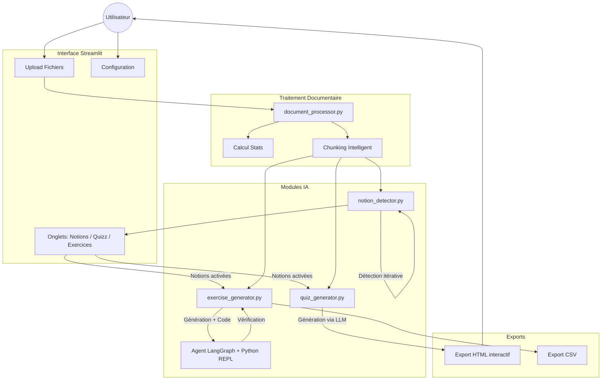

# 📝 Générateur de Quizz & Exercices IA (Streamlit + LangGraph)

Application Streamlit permettant de générer automatiquement des **Quizz QCM** et des **Exercices mathématiques/logiques** à partir de **multiples documents** PDF, DOCX, ODT, PPTX et TXT, en utilisant des modèles LLM via l'API OpenAI (ou compatible).

## ✨ Fonctionnalités

### 🎯 Quizz QCM

- **Support multi-documents** : Uploadez **plusieurs fichiers simultanément** et générez des questions couvrant l'ensemble des documents.
- **Extraction multi-format** : Support des fichiers **PDF, DOCX, ODT, ODP, PPTX et TXT**.
- **Extraction flexible** du texte :
  - **Mode "Page par page / Slide par slide"** : Idéal pour conserver la référence précise des sources.
  - **Mode "Par blocs de tokens"** : Permet d'analyser de longs contextes en continu (fenêtre glissante).
- **Sélection dynamique du modèle** : Choisissez le modèle LLM directement depuis l'interface (récupération automatique via l'API).
- **Génération multi-niveaux** :
  - Configurez simultanément le nombre de questions pour chaque niveau (**Facile**, **Moyen**, **Difficile**) en un seul run.
  - **Éditeur de Prompts** : Personnalisez totalement les instructions pédagogiques pour chaque niveau de difficulté directement dans l'interface.
- **Paramétrage précis** :
  - Nombre de choix de réponses (A, B, C, D... jusqu'à G).
  - Nombre de bonnes réponses (choix multiple possible).
- **Questions autonomes** : Les questions sont conçues pour être répondables **sans le document source**, uniquement avec les connaissances acquises en formation. Aucune référence de type "selon le texte" n'est utilisée.
- **Mélange des réponses** : Option de shuffle aléatoire des choix (activée par défaut) pour éviter que la bonne réponse soit toujours en A ou B.
- **Export HTML interactif** : Téléchargez un fichier HTML autonome avec design sombre, score en temps réel et explications détaillées.
- **Badges de difficulté** : Chaque question affiche son niveau de difficulté avec un badge coloré (🟢 Facile, 🟡 Moyen, 🔴 Difficile).
- **Citations précises** : Les explications incluent une citation exacte du texte source.
- **Attribution des sources** : Document source et numéro de page précis pour chaque question.

### 🧮 Exercices & Problèmes (Maths / Logique / Science)

- **Génération d'exercices complexes** nécessitant calcul et raisonnement multi-étapes.
- **Exercices autonomes** : L'énoncé fournit toutes les données nécessaires, résolvable sans le document source.
- **Vérification automatique par Agent IA** : Un agent LangGraph exécute du code Python pour vérifier la validité de la réponse et de la correction proposée par le LLM.
- **Code de vérification complet** : Le code Python reproduit intégralement le raisonnement pas à pas (pas de simple `result = valeur`).
- **Prompt personnalisable** : Modifiez directement les instructions envoyées à l'IA pour la génération d'exercices via un éditeur dans l'interface, avec bouton de réinitialisation.
- **Affichage complet** : Énoncé, Réponse attendue, Étapes de résolution détaillées, Code de vérification Python.
- **Citations et sources** : Chaque exercice indique la citation du texte source et le document/page d'origine.

### 📚 Notions Fondamentales

- **Détection automatique** : L'IA identifie les concepts clés, définitions, théorèmes et principes des documents.
- **Édition interactive** : Activez/désactivez, supprimez ou ajoutez manuellement des notions.
- **Chat LLM** : Modifiez les notions en langage naturel (ex: *« Ajoute une notion sur les dérivées partielles »*).
- **Guidage de la génération** : Les notions activées orientent les quizz et exercices vers les concepts essentiels.

### 📊 Statistiques & Suivi Global

- **Tableau de bord** : Suivi persistant du nombre total de questions et exercices générés, de documents traités et de tokens consommés (IA).
- **Interface intégrée** : Affichage permanent des métriques globales dans la barre latérale pour suivre l'utilisation de l'outil dans le temps.

---

## 🛠️ Installation

### Prérequis

- Python 3.10 ou supérieur.
- [uv](https://github.com/astral-sh/uv) (recommandé pour la gestion d'environnement, sinon pip/conda).
- Accès à une API compatible OpenAI (OpenAI, LocalAI, vLLM, etc.).

### 1. Cloner le projet

```bash
git clone <votre-repo>
cd generateur_de_quizz
```

### 2. Créer l'environnement virtuel et installer les dépendances

**Avec UV (recommandé) :**

```bash
uv venv .venv
# Windows
.venv\Scripts\activate
# Linux/Mac
source .venv/bin/activate

uv pip install -r requirements.txt
```

**Avec Pip standard :**

```bash
python -m venv .venv
# Activer l'environnement...
pip install -r requirements.txt
```

### 3. Configuration (.env)

Copiez le fichier `.env.example` vers `.env` et configurez vos accès API :

```bash
cp .env.example .env
```

Éditez `.env` :

```ini
# URL de base de votre API (ex: API locale, OpenAI, vLLM...)
OPENAI_API_BASE=http://votre-serveur:8080/v1

# Clé API (si nécessaire)
OPENAI_API_KEY=sk-xxxxxxxxxxxxxxxx

# Nom du modèle à utiliser
MODEL_NAME=gtp-oss-120b

# Fenêtre de contexte du modèle (en tokens)
MODEL_CONTEXT_WINDOW=32000

# Encodeur tiktoken (cl100k_base pour GPT-4, o200k_base pour GPT-4o)
TIKTOKEN_ENCODING=cl100k_base
```

---

## 🚀 Utilisation

Lancez l'application Streamlit :

```bash
streamlit run app.py
```

L'application s'ouvrira dans votre navigateur par défaut (généralement `http://localhost:8501`).

1. **Upload** : Chargez un ou **plusieurs fichiers** (PDF, DOCX, ODT...) dans la barre latérale.
2. **Configuration** :
    - Ajustez le mode de lecture et la taille des chunks.
    - Sélectionnez le **Modèle LLM** souhaité dans la liste déroulante.
3. **Onglet Notions** :
    - Cliquez sur **"🔍 Détecter les notions fondamentales"** pour identifier les concepts clés.
    - Activez/désactivez les notions pour guider la génération.
    - Utilisez le chat LLM pour modifier les notions en langage naturel.
4. **Onglet Quizz** :
    - Saisissez le nombre de questions pour chaque niveau (Facile, Moyen, Difficile).
    - Activez/désactivez le **mélange des réponses** (🔀) pour randomiser la position des bonnes réponses.
    - (Optionnel) Modifiez les instructions spécifiques envoyées à l'IA dans l'expandeur **"Personnaliser les Prompts"**.
    - Cliquez sur **"Générer le Quizz"**.
    - Visualisez les questions avec leurs badges de difficulté, citations et sources. Téléchargez en HTML ou CSV.
5. **Onglet Exercices** :
    - Choisissez le nombre d'exercices.
    - (Optionnel) Modifiez le **prompt d'exercice** dans l'expandeur **"Personnaliser le Prompt d'Exercice"**.
    - Cliquez sur **"Générer les Exercices"**.
    - L'agent IA va générer et *vérifier* chaque exercice via l'exécution de code Python complet.

## 🧠 Fonctionnement détaillé

### 📏 Stratégies de Chunking

Le logiciel découpe le PDF en "chunks" (segments) avant de les envoyer au LLM pour éviter de dépasser la fenêtre de contexte et pour permettre une analyse ciblée :

- **Page par page** : Chaque page est traitée comme une unité isolée. C'est la méthode la plus précise pour l'attribution des sources.
- **Par blocs de tokens (Défaut)** : Le texte est découpé en segments de taille fixe (ex: 10 000 tokens) avec chevauchement.
  - Idéal pour analyser des contextes longs.
  - **Précision** : Des marqueurs `[Début Page X] ... [Fin Page X]` sont insérés automatiquement dans le texte pour que l'IA puisse citer précisément ses sources, même au milieu d'un bloc de 50 pages.

### 🎯 Distribution des Questions (Quizz)

Le système ne se contente pas d'envoyer tout le texte au hasard. Pour un quizz de $N$ questions :

1. Il calcule le poids de chaque chunk par rapport au volume total de texte.
2. Il répartit les $N$ questions proportionnellement à la taille des chunks.
3. Seuls les chunks "utiles" sont envoyés à l'IA, optimisant ainsi la consommation de tokens et la pertinence pédagogique.

### 🤖 Vérification Agentique (Exercices)

Contrairement aux quizz classiques, les exercices mathématiques ou logiques passent par un cycle de **vérification en boucle fermée** :

1. **Génération** : Un premier LLM crée l'énoncé, la solution et un script Python de vérification.
2. **Exécution** : Un **Agent ReAct** (via LangGraph) prend le script, l'exécute dans un environnement Python (REPL).
3. **Validation** : L'agent compare le résultat de l'exécution avec la réponse annoncée par le premier LLM.
   - Si les résultats concordent, l'exercice est marqué comme **Vérifié ✅**.
   - En cas d'erreur, le système peut tenter de re-générer l'exercice (auto-correction).

---

## 🏛️ Diagramme Structurel



---

## 🏗️ Architecture du projet

- `app.py` : Interface utilisateur principale (Streamlit).
- `ui_components.py` : Composants UI réutilisables (stat cards, badges difficulté, sources).
- `stats_manager.py` : Gestionnaire de sauvegarde persistante (JSON) pour le suivi des statistiques globales.
- `document_processor.py` : Extraction de texte multi-format et découpage intelligent (support multi-documents).
- `notion_detector.py` : Détection et édition des notions fondamentales via LLM.
- `llm_service.py` : Client API OpenAI, gestion des tokens et retry logic.
- `quiz_generator.py` : Logique de création des QCM avec citations, difficulté et sources précises.
- `exercise_generator.py` : Création d'exercices et **Vérification Agentique** (LangGraph + sous-processus sandbox).
- `quiz_exporter.py` : Export HTML interactif (Jinja2) et CSV enrichis.
- `templates/quiz_template.html` : Template HTML/CSS/JS pour l'export des quizz (badges difficulté, citations, sources).

## 📦 Dépendances principales

- `streamlit` : Interface Web.
- `langchain`, `langgraph`, `langchain-openai`, `langchain-experimental` : Orchestration LLM et Agents.
- `openai` : Client API standard.
- `pdfplumber`, `python-docx`, `odfpy`, `python-pptx` : Extraction multi-format.
- `tiktoken` : Tokenizer OpenAI rapide.
- `jinja2` : Templating HTML.

---

## ⚠️ Notes importantes

- **Sécurité** : L'agent de vérification des exercices exécute du code Python généré par le LLM dans un **sous-processus isolé** avec un timeout de 30 secondes. Cela offre une isolation de base (le code ne peut pas affecter le processus principal), mais n'est pas équivalent à un sandbox Docker. Utilisez ce logiciel dans un environnement de confiance pour la production.
- **Modèles** : L'interface permet de choisir n'importe quel modèle disponible sur votre API. Testé principalement avec `gtp-oss-120b`.
- **Chunking** : Deux modes sont disponibles : **Page par page** (recommandé pour la précision des sources) et **Par blocs de tokens** (pour une analyse large, jusqu'à 15 000 tokens).
- **Tiktoken** : L'encodeur tiktoken est configurable via `TIKTOKEN_ENCODING` dans `.env`. Utilisez `cl100k_base` pour GPT-4 ou `o200k_base` pour GPT-4o.

## 📄 Licence

MIT License — Voir le fichier [LICENSE](LICENSE) pour plus de détails.
